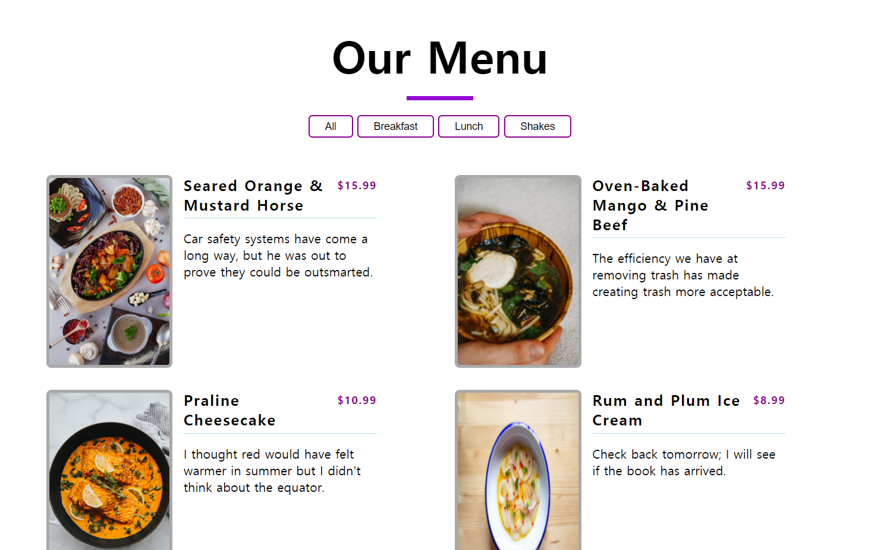

# Menu-Project
 
<ol>
  <li><strong>프로젝트 이름</strong> : Menu Project</li>
  <li><strong>사용 언어</strong> : HTML, CSS, Vanila Javascript</li>
  <li><strong>주요 기능</strong> 
    <ul>
      <li>메인화면: 모든 메뉴의 이름, 가격, 특징이 표시됩니다.</li>
      <li>필터링: 타이틀 아래에 breakfast, lunch, shakes 등 필터 버튼을 누르면 해당 항목에 포함되는 메뉴들만 페이지에 표시됩니다.</li>
    </ul>
   </li> 
  <li><strong>배운점</strong>: 리스트 작성 및 필터링 기능을 추가 할때에는, 1. 우선 각 필터링 button에 카테고리별 data-id를 설정하고, 2. 각 품목들에게도 동일한 data-id를 설정해주면 쉽게 이를 구성할 수 있음  </li>

   

  <h5> 메인 화면 </h5>
   
  
  <h5> 필터링 화면 </h5>
   
  

     
